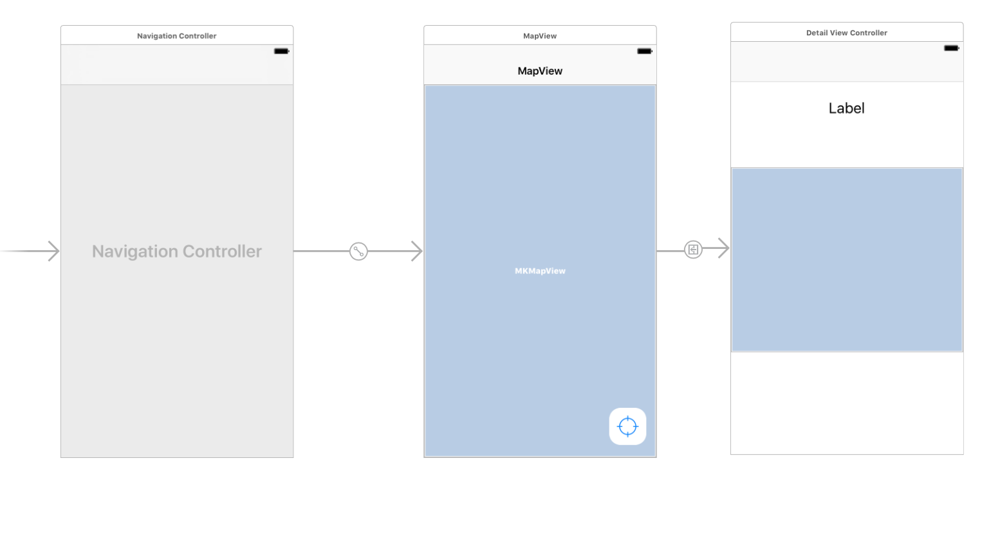
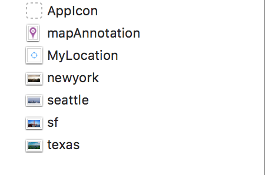

The Map Kit framework lets you embed a fully functional map interface into your app. The map support provided by this framework includes many features of the Maps app in both iOS and OS X. You can display standard street-level map information, satellite imagery, or a combination of the two. You can zoom, pan, and pitch the map programmatically, display 3D buildings, and annotate the map with custom information. The Map Kit framework also provides automatic support for the touch events that let users zoom and pan the map.

In this tutorial we will discuss best practices for using iOS MapKit framework. In this page, We'll cover:

1. Why not Google Map ?
2. Download Starter Project

# Why not Google Map ?

## Cons of Google Map

- Google Map makes your app at least 20MB bigger! Unlike Google Maps, MapKit is native to iOS, which means your app size will stay the same regardless of using MapKit technology.
- MapKit has a much better integration with CoreLocation and CoreAnimation.

## When to use Google Map ?

- If you want to enable street-view.
- If you want to use google location search.
- Or you just love Google Maps.

# Download the starter project

You should download [starter project](https://github.com/hao44le/MapKit-Tutorial-Beginner) to get started.

So, what's inside the starer project ?

## Basic configuration on StoryBoard



## Image Asset

Icons are from icons8.com. Images are from unsplash.com



## Location Data

```
 typealias coordinate = (latitude:Double, longitude: Double)
    
 let names:[String:coordinate] = ["newyork":(40.7128,-74.0059),"seattle":(47.6062,-122.3321),"sf":(37.7786,-122.3893),"texas":(31.9686,-99.9018)]

```
